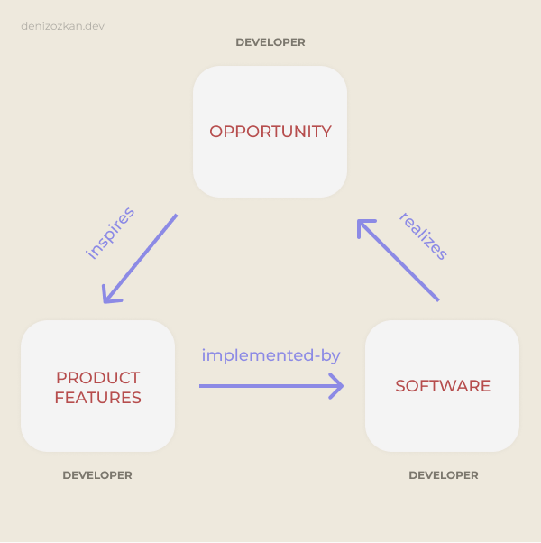
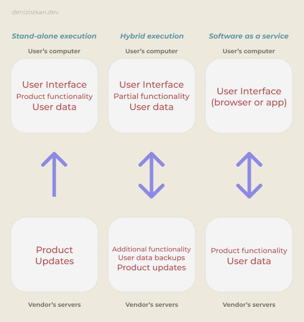

# Software Products

Yazılım ürünleri, belirli bir kesimde müşteriye hitap eder. Büyük çaplı kurumsal yazılımlardan, mobil uygulamalar ya da oyunlar gibi kişisel kullanım amaçlı olanlara kadar, çeşitli yazılım ürünleri olabilir.

## Project-based software engineering

Ürün bazlı yazılımlar ihtiyaçlarla birlikte ortaya çıkar. Müşteri ve geliştirici bu ihtiyaçlar üzerinde düşünürler ve ürün oluşmaya başlar.

    

Var olan bazı gereksinimler, developer tarafından yerine getirilir ve yazılım ortaya çıkar. Ortaya çıkan yazılım, gereksinimdeki bir problemi çözmeye çalışır. Müşteri, problemin çözüldüğünü gördüğünde, yeni bir problemin daha çözülmesi için ya da problemin kısmen çözüldüğünü görerek, yeni gereksinimler ortaya koyabilir.

Diğer bir durumda ise, müşteri bir problemi ile birlikte gelebilir. Müşteri ve geliştirici o problemin çözümü için ihtiyaçları ortaya çıkarırlar. İhtiyaçlar toplandıktan sonra bir yazılım geliştirilir ve bunu problemin çözümü için sunarlar.

Her iki durumda da bu döngü sürekli olarak devam eder. Başlangıç noktası ihtiyaçlar olan durumda, müşteri yeni gereksinimler sunarak ürünün geliştirilmesine destek olabilir ve bu süreci devam ettirebilir.

Diğer yandan, müşterinin problemini çözdüğü düşünülen yazılım ortaya çıktıktan sonra yeni problemler ya da ek ihtiyaçlar ortaya çıkabilir. Dolayısıyla döngü tekrardan devam eder.

## Product software engineering

    

Yazılım ürünü geliştirmede bir diğer yaklaşım ise senaryonun geliştiricide başladığı durumdur. Geliştirici taraf (firmalar) bir fırsat görür (piyasada olmayan ya da eksik olan bir özellik/ürün gibi) ve bu fırsata göre yazılım ürününe eklenecek özellikler belirlenir. Daha sonra bu özellikler geliştirilir ve yazılım gerçeklenir. Yazılımın gerçeklenmesinden sonra yeni fırsatlar kovalanıp ürüne yeni özellikler eklenir ve döngü devam eder.

## Software product lines and platforms

### Software product line

Yazılımlar özel bir ürün bandında ortaya çıkabilir. Örneğin bir sigorta yazılımı 3 farklı A, B, ve C sigorta firmalarına satılabilir. Bu durumda herbir firma için yazılımın özelleştirilmesi gerekir.

### Platform

Bir yazılım başka yazılımlar için bir zemin olabilir. Örneğin Facebook, kendi özelliklerinin yanında ekstradan başka oyunlar ve uygulamalar için bir platformdur.

## Software execution models

Yazılımları, çalışma ortamlarına göre şu şekilde sınıflandırmak mümkündür:

- **Stand-alone:** Tek başına çalışan model. Örneğin, müşterinin telefonunda veya bilgisayarında çalışan bir yazılım. Ya da, bir dokunmatik ekranda çalışan bir yazılım, stand-alone bir yazılımdır. Örneğin, masaüstü yazılım uygulamaları, Photoshop...

- **Hybrid:** Çalışırken sunucuyu da kullanan model. Örneğin, müşterinin telefonunda veya bilgisayarında çalışan bir yazılımda, bazı özellikler için sunucudan sonucun alındığı model, Hybrid bir yazılım modelidir. Örneğin, veritabanı uygulamaları, ofis uygulamaları...

- **Software service:** Sadece sunucuda çalışan model. Örneğin, bulut depolama servisleri, Steam, YouTube...

    

## Comparable software development

Yazılım projeleri büyüklüklerine, karmaşıklıklarına ya da hedeflerine göre karşılaştırılabilir.

- **Student projects:** Karşılığında bir ödeme alınmayan, bireysel ya da grup olarak bir kurs için hazırlanan, istenen özelliklerin belli olduğu yazılım ödevleri olabilir.

- **Research software:** Araştırmacı ya da araştırma grubu, karmaşık sistemler hakkında araştırmalarıyla ilgili soruları yanıtlamalarına yardımcı olacak bir yazılım geliştirebilir.

- **Internal tool development:** Kurum içi süreçler için geliştirilmiş araçlar olabilir. Öğrenci bilgi sistemi içerisinde transkript oluşturan bir yazılım örnek olarak verilebilir.

## The product vision

Bir yazılımın ürün olarak ortaya çıkması için bir ürün vizyonu gereklidir. Geliştirilecek ürünün temelde şu sorulara cevap vermesi gerekir:

- Geliştirilecek ürün nedir?
- Hedef müşteriler ve kullanıcılar kimler?
- Müşteriler bu ürünü neden almalı?

### Moore's vision template

Bir ürün vizyonu şunları içeren bir şablonda tasarlanabilir:

- FOR (target customer)
- WHO (statement of the need or opportunity)
- THE (PRODUCT NAME) is a (product category)
- THAT (key benefit, compelling reason to buy)
- UNLIKE (primary competitive alternative)
- OUR PRODUCT (statement of primary differentiation)

### Vision template example

Örnek olarak, CRM-Innovator adlı bir ürün için vizyon şablonuna göre oluşturulmuş ürün vizyonu şu şekilde olabilir:

> “FOR a mid-sized company's marketing and sales departments WHO need basic CRM functionality, THE CRM-Innovator is a Web-based service THAT provides sales tracking, lead generation, and sales representative support features that improve customer relationships at critical touch points. UNLIKE other services or package software products, OUR product provides very capable services at a moderate cost.”

**FOR:** Hedef kitlesinin orta ölçekli şirketlerin pazarlama ve satış departmanları olduğu belirtiliyor.

**WHO:** İhtiyacın; temel CRM işlevselliği olduğu belirtiliyor.

**THE:** CRM-Innovator'ın; web tabanlı bir servis olduğu,

**THAT:** Sağladıklarının; satışları takip etmek, referans oluşturmak ve satış temsilcileri için müşteri ilişkilerini iyileştirecek özellikleri olduğunu belirtiyor.

**UNLIKE:** Alternatif olarak başka servisler ya da paket yazılım ürünlerinin olduğundan bahsediyor.

**OUR PRODUCT:** Alternatiflerinden farklı olarak; çok özellikli ve uygun fiyatlı olduğu belirtiliyor.

- FOR ve WHO: müşteriyi,
- THE: ürünü,
- THAT: özellikleri,
- UNLIKE ve OUR PRODUCT: ürünü, diğerlerinden ayıran kısımları ifade etmektedir.

Dolayısıyla böyle bir ürün vizyonu, kısa bir şekilde tüm ürünü özetlemektedir.

## Information sources for developing a product vision

Ürün vizyonunu ortaya koymak için şunlara ihtiyaç duyulur:

- Domain experience
- Product experience
- Customer experience
- Prototyping and playing around

Ürün vizyonu şu 3 soruya cevap barındırır:

- What
- Who
- Why

## Product management concerns

    

Ürün ortaya konurken bilinmesi gerekenler şunlardır:

- **Business needs:** Ürün yöneticilerinin, ürün vizyonu ile geliştirilen ürünün uyuştuğundan emin olmaları gerekir.

- **Technology constraints:** Ürün yöneticileri, müşteri için önemli olan teknoloji sorunlarından eliştiricileri haberdar etmelidirler.

- **Customer experience:** Ürün müşteriye sunulmadan önce müşterilerle düzenli olarak ürünün gidişatı, tam olarak üründe arananlar ve ürünün kullanım şekli hakkında toplantılar yapılmalıdır.

## Technical interactions of product managers

    

Ürün ortaya konurken ürün yöneticisinin bilmesi gerekenler şunlardır:

- Product vision management
- User stories and scenarios
- Customer testing
- User interface design
- Acceptance testing
- Product backlog management

## Product prototyping

Ürün ortaya konmadan önce prototipi oluşturulur. Prototip çıkarmak, müşterinin istekleri ile geliştirilen ürünün paralel gidip gitmediğini erkenden anlayabilmek açısından önemlidir.

Prototip oluşturmada her zaman, geliştirmelerden sonra atılıp tekrardan yapılmaya açık olunmalıdır.

Prototipleme ile, ürünün yapılabilirliği ispat edilir ve müşteriye, ortaya çıkacak ürün hakkında görsel bir önizleme gösterilmiş olur.
