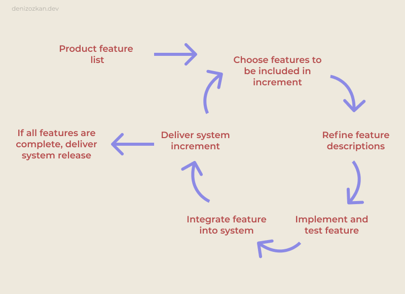

# Agile Software Engineering

Yazılım ürünü geliştirme süreci içerisinde uygulanabilecek çeşitli yaklaşımlar vardır. Bunlardan bazıları:

**Waterfall modeli:** Genellikle büyük çaplı ya da işe koyulmadan önce planlanması büyük önem gerektiren sistemler için uygulanabilecek bir modeldir. Gereksinim analizleri -> Sistem Tasarımı -> Geliştirme -> Test -> Yayınlama -> Bakım gibi, birbiri ardına aşamalarla ürün ortaya koyma süreci tamamlanır. Her aşama en iyi şekilde tamamlandıktan sonra diğer bir aşamaya geçilir. Ürün son aşamada müşteriye sunulabilir hale gelir.

**Agile modeli:** Agile, bir yazılımı en kısa sürede ürüne dönüştürmeyi amaçlayan bir yaklaşımdır. Waterfall modelinden farklı olarak yaklaşım, ürünü tüm aşamalar sonucunda kullanıma sunmaktan ziyade, hedef üründe istenen özelliklerin parça parça tamamlanıp hızlıca müşteri kullanımına sunulabilir (MVP - most viable product) ürün çıkarmak şeklinde bir yaklaşımdır. Bunu yapabilmek için kaynakların hepsini o projeye ayırmak gerektiğinden maliyetlidir ve genellikle kalabalık olmayan, müşteriden alınan geri dönüşlerle ürünü geliştiren ekiplerce tercih edilir.

Scrum, Extreme Programming (XP), Lean Software Development, Kanban, ... gibi birçok farklı agile metodolojisi vardır.

**V-modeli:** Geliştirilme yapıldıktan sonra, bir sonraki aşamaya geçmeden önce testinin yapıldığı modeldir.

## The agile manifesto

Yazılım alanında oldukça tecrübeli 17 kişinin bir araya gelip, "daha iyi bir yazılım geliştirme metodu uygulanabilir mi?" sorusuna cevap aramaları sonucu agile (çevik) modeli ortaya atılmıştır.

Agile yaklaşımı, yazılım geliştirmenin iyi yollarını arar ve;

- Süreçler ve araçlardan ziyade **bireyler ve etkileşimlere**
- Kapsamlı dökümantasyondan ziyade **çalışan yazılıma**
- Sözleşme pazarlıklarından ziyade **müşteri ile işbirliğine**
- Bir plana bağlı kalmaktan ziyade **değişime karşılık vermeye**

değer verir.

Sol taraftaki maddelerin değeri kabul edilir ancak sağ taraftakiler (kalın olanlar) daha değerlidir.

## Incremental development

Tüm agile metodları incremental (artımlı) geliştirmeye dayanır. Buna göre, geliştirilen üründe odaklanan şey, yazılımda yer alacak özelliklerdir. İlk olarak; kabaca, en önemli özellikleriyle çalışan bir yazılım ortaya konur ve daha sonra gelen geri dönüşlerle birlikte detay özellikler eklenerek ya da çıkartılması gereken özellikler çıkartılarak geliştirmeye devam edilir.

    

- **0 - Product feature list:** Üründe olması istenen özellikler listelenir.

- **1 - Choose features to be included in increment:** Geliştirme sürecine dahil edilecek özellik seçilir.

- **2 - Refine feature descriptions:** Geliştirilecek ürün özelliği biraz daha detaylandırılır. Bu aşamada alt özellikler ya da başka eklenebilecek özellikler ortaya çıkabilir. Bu durumda, 0. adımdaki özellik listesine bu özellikler eklenebilir.

- **3 - Implement and test feature:** Özellik geliştirilir ve testi yapılır.

- **4 - Integrate feature into system:** Özellik, ürüne eklenir.

- **5 - Deliver system increment:** 0. adımdaki özellik listesinde, geliştirilmek üzere bekleyen özellik kalmayıncaya kadar döngüye devam edilir. Tüm özellikler tamamlandığında ürün sürümü yayına alınır.

## Agile development principles

Tüm geliştirme sürecinde, agile yaklaşımı ile şu hususlara dikkat edilir:

- **Involve:** Geliştirmeye bireyler dahil edilmelidir. Müşteriler ve geliştirme ekibi temas halindedir ve sürekli olarak geri dönüşler alınarak üründe olması istenenler netleşir. Müşteriler ile, artımlı geliştirmenin her tamamlanan döngüsünde iletişime geçilmelidir.

- **Embrace:** Müşteriler tarafından gelen geri dönüşlerle birlikte sürekli olarak bir değişim halinde olunabilir. Bu değişime uyulmalı ve yazılım bu değişikliklere göre şekillendirilmelidir.

- **Develop and deliver:** Waterfall metodunun aksine; her incremental development döngüsünde, ortaya kullanılabilir bir ürün çıkarmaya odaklanılmalıdır.

- **Maintain simplicity:** Mümkün olduğunca karmaşık yapılardan kaçınılmalı ve basit çözümler bulunmalıdır. Örneğin, bir özelliğin geliştirildiği döngünün 2 haftalık bir zaman dilimi içinde tamamlanması hedeflenmiş olsun. Zamanın yetmeyeceğinin düşünülmesi durumunda, döngü süresini uzatmak yerine o özellik, sonraki döngülerde tamamlanmak üzere es geçilmelidir.

- **Focus on people, not things:** Eğer ekip üyelerinin birtakım şeylere erişmesi gerekiyorsa onlara bu erişim sağlanmalıdır. Ekibe güvenilmelidir ve herkesten aynı şekilde çalışması beklenilmemelidir. Takım üyeleri, kuralcı yazılım süreçleri ile sınırlandırılmadan kendi çalışma yöntemlerini geliştirmeye bırakılmalıdır. Müşterilerin ulaşması gereken bir bilgi varsa onlara bu bilgi verilmeli, yolunda gitmeyen şeyler varsa yoluna koyulmalıdır.

---

## Extreme programming

Extreme programming (XP), yazılım geliştirme ekibinin maksimum performansta çalıştığı bir agile yaklaşımıdır.

XP, şu geliştirme tekniklerine odaklanır:

- **Incremental programming:** Başlangıçta büyük bir plan yapmak yerine planı döngülere yaymak. Müşteri ile iletişime geçilip, her çevrimde seçilen özellikler üzerinde tartışılabilir.

- **Continuous integration:** Her özelliğin geliştirilmesinden sonra sürekli olarak bu özelliklerin sisteme entegre edilmesi.

- **Test-first development:** Önce testin yazılıp, sonrasında teste yönelik uygulamanın gerçekleştirilmesi.

- **Refactoring:** Yazılan kodun gözden geçirilip, yapısal olarak uygun, temiz, kolay anlaşılır, verimli ve güvenli olmasının sağlanması.

- **Small releases:** Her seferinde üzerine koyulabilecek ürünlerin ortaya çıkarılması.

- **Collective ownership:** Ürünü, tüm ekip üyelerinin sahiplenmesi. Herkes ürünü sahiplenirse, herkes o ürünün başarısı için çalışır.

- **Pair programming:** Bir tecrübeli ve bir tecrübesizin aynı bilgisayar üzerinde çalışmasıdır. Bir kişinin kod yazarken diğerinin izlemesi şeklinde gerçekleşir.

- **Sustainable pace:** Belirli bir hızda çalışma. Hedeflenen sürede bitirmek için çalışılmamalıdır.

- **On-site customer:** Müşteri tarafında geliştirme.

- **Simple design:** Basit bir tasarım.

## Scrum

Scrum, bir diğer agile yazılım metodolojisidir. Düzenli geri bildirimler ve planlamalar ile uygulanır.

### Scrum terminology

- **Product:** Scrum takımı tarafından geliştirilecek üründür.

- **Product owner:** Patron, analist ya da müşteri temsilcisi gibi ürünü temsil edebilecek, pazarlayabilecek, müşteriye ulaştırabilecek ve aynı zamanda scrum ekibi ile birlikte çalışarak ürünü test edip onaylayabilecek takım üyesidir.

- **Product backlog:** Buglar, özellikler, ürün iyileştirmeleri gibi Scrum ekibi tarafından tamamlanacak bir yapılacaklar listesidir. Her çevrimde bu listeden bir task yapılmak üzere alınır. Liste, müşteriler ile görüşüldükten sonra değişebilir.

- **Development team:** 3 - 8 arası kişiden oluşan geliştirme ekibidir. Geliştirme ekibi; product backlog'tan, kendi kendilerine task seçebilecek ve birbirlerini destekleyebilecek nitelikte olmalıdır.

- **Sprint:** 2 - 4 hafta gibi belirlenen bir süredir. Bu süre içerisinde product backlog'tan seçilen task yapılır ve ardından ürüne eklenir.

- **Scrum:** Günlük olarak yapılan, ekip üyelerinin o gün neler yapacaklarını, sürecin ne durumda olduğunu, bir problemin yaşanıp yaşanmadığı konusunda diğer ekip üyelerini bilgilendirdiği toplantılardır. Bir sorun varsa bu toplantılarda bahsedilir ancak çözümü için ayrı toplantılar düzenlenir.

- **ScrumMaster:** Ekibe yönlendiricilik yapan bir ekip üyesidir. Problemler yaşandığında çözüme ulaşma konusunda öncülük eder.

- **Velocity:** Tahmini olarak, yapılacak işler için öngörülen hızdır. Tek bir sprintte tahmini olarak ne kadar işin yapılabileceği konusunda bilgi sahibi olunur.

    

İki temel liste üzerinden süreç işlemektedir. Birincisi, ürün temel listesi; ikincisi, bu listeden seçilmiş ara işlerin bulunduğu Sprint listesi.

İlk çevrimde yapılacak işlerin listesi (product backlog) oluşturulurken, ikinci çevrimde, seçilen işlerin yapılmasından sonra en baştaki listeye dönülüp kalan işler üzerinden döngüye devam edilir.

### Benefits of using Scrum

- Havada kalan gereksinimler olmayacaktır.

- Ürün parçalara bölünerek müşteriler için anlaşılır ürün versiyonları ortaya çıkar.

- Müşteriler belirli periyotlarla ürünü deneyimleyebilecek ve daha doğru geri dönüşler yapabileceklerdir.

- Ekip, ürünü sahiplenecek ve birbirleri ile sürekli iletişim halinde olacaktır.

- Müşteri ve ekibin görüşleri alınarak ürün geliştirildiğinden, karşılıklı güven ve sahiplenme artacaktır.

### Product backlogs

Product backlog; özellikleri, kullanıcı isteklerini, bugları, temel geliştirme faaliyetlerini ve istenen engineering iyileştirmelerini içeren bir yapılacaklar listesidir.

Product backlog, ilk kez oluşturulduktan sonra gözden geçirilerek detaylandırılır. Detaylandırılırken şunlar uygulanır:

- **Refinement:** Bir task yeterince atomik değilse sub-tasklere ayrıştırılır.

- **Estimation:** Her task için tahmini bir süre belirlenir.

- **Prioritization:** Her task önem sırasına göre önceliklendirilir. Bu önceliklendirme product owner, ekip veya müşteri tarafından ya da hepsinin bir araya gelip kararlaştırmasıyla yapılabilir.

- **Creation:** Yeni çıkan buglar ya da yeni istenen özelliklerin olması gibi durumlar neticesinde liste genişletilebilir.

### PBI estimation metrics

Product backlog'taki itemlar için tahmini olarak ne kadar süre alacaklarını belirleyebilmek üzere bazı yöntemler mevcuttur. Ekip üyelerine bir item için ne kadar süre alacağı hakkında sorulduğunda çok farklı cevaplar ya da birbirinden etkilenmiş olabilecek, yanıltıcı cevaplar alınabilir. Bu noktada, "scrum poker" uygulanarak cevaplar kapalı bir şekilde, üyelerin birbirlerinin oylarını görmeden oy vermesi yoluna gidilir. Yapılan tahminler, product backlog'taki itemlar arasında bir bağımlılık söz konusu olmadan, yalnızca o item için yapılır.

Kapalı olarak, yapılan tahminler daha sonra ekipçe incelenir ve üzerine tartışılır. Bir item için verilen tahmini süre aralıklarının çok geniş olması durumunda yine belli başlı yöntemlere gidilebilir.

Örneğin, bir mouse için yazılım üreten bir firmada, product backlog'ta şöyle bir item olsun:

- Mouse için Linux sürücü yazılması

verilen oylar içerisinde, kendi gerekçelerine göre tahmini süreler 1 hafta da olabilir, 9 ay da olabilir. Yaklaşık bir karara varmak için Fibonacci (1, 1, 2, 3, 5, 8, 13, ... şeklinde ilerleyen sayılar) ya da kıyafet beden ölçüleri (S, M, L, XL, XXL, vb.) birim olarak kullanılabilir. S'ye karşılık 2 hafta, M'ye karşılık 1 ay gibi tanımlamalar yapılabilir. Örneğin, bu item için yaklaşık tamamlanma süresi oylama sonucunda L çıkması durumunda, bu yönteme gidilmeden önce ekip üyelerinin geniş tahmin aralıkları daha da daraltılmış olur ve sonuç olarak uygun bir zaman tahminine daha kolay karar verilebilir.

### Timeboxed sprints

Scrum metodolojisinde, kısıtlı zamanda daha planlı çalışıp, o zaman aralığında var olan problemler çözülmeye odaklanılır ve ekip sadece bu işe özel çalışır.

Belirli zaman içerisinde yalnızca belirli itemların geliştirilmesi gibi bir süreç işlendiği için Scrum'ın verimliliği arttırdığı söz konusudur. Problem, daha da büyümesi halinde geçerli timebox'ın dışına alınıp, sonraki sprintlere daha sonra çözülmesi için aktarılabilir.
